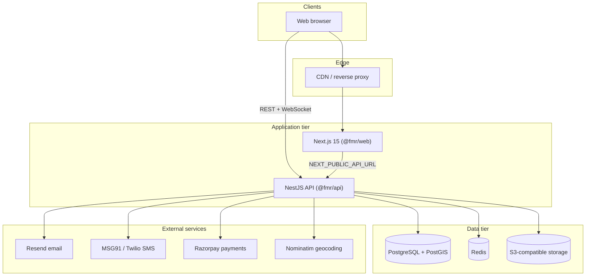
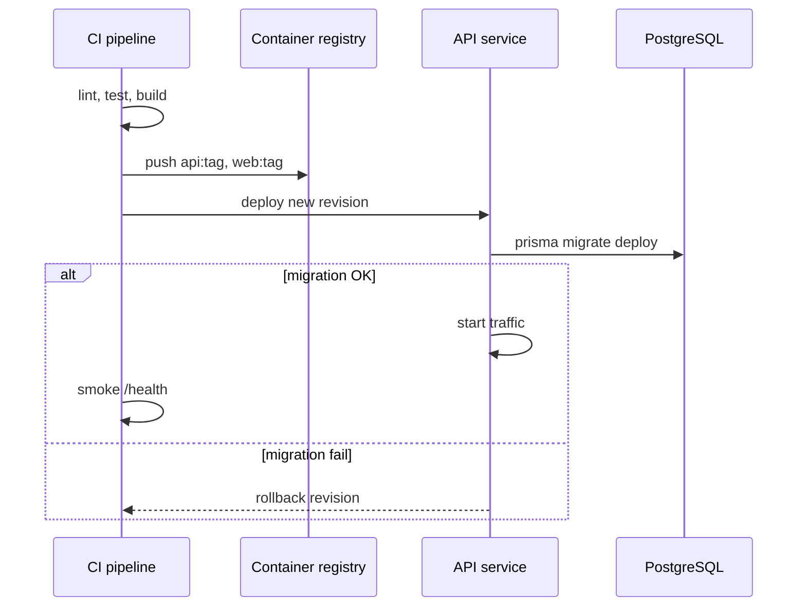

# Alaya (FindMyRoommate) — Deployment Strategy

This document describes how to deploy the monorepo to **development**, **staging**, and **production**. It reflects the current stack as of September 2026.

---

## 1. System overview



| Component | Technology | Purpose |
|-----------|------------|---------|
| Web | Next.js 15, React 19 | SSR/CSR UI, discover, chat client |
| API | NestJS 11, Prisma 6 | REST, JWT auth, Socket.IO chat |
| Database | PostgreSQL 16 + PostGIS | Users, listings, matches, agreements |
| Cache | Redis 7 | OTP, email tokens, refresh tokens, premium flags |
| Object storage | MinIO (dev) / S3 (prod) | Profile photos, room/PG/flat images |
| Shared | `@fmr/shared` | Localities, matching constants |

**Health checks**

- API: `GET /health` → `{ "ok": true, "service": "find-my-roommate-api" }`
- Web: HTTP 200 on `/` or `/login`

---

## 2. Environment tiers

| Tier | Purpose | Data | Integrations |
|------|---------|------|--------------|
| **Local** | Developer machines | Docker Compose + seed | Mock OTP (`123456`), console email |
| **Staging** | QA, demos, pre-release | Isolated DB, no prod PII | Test Razorpay keys, Resend sandbox |
| **Production** | Real users (Bengaluru launch) | Managed Postgres, backups | Live SMS, email, payments |

**Domain layout (recommended)**

| Service | Staging | Production |
|---------|---------|------------|
| Web | `staging.alaya.app` | `alaya.app` |
| API | `api.staging.alaya.app` | `api.alaya.app` |
| Media | `cdn.alaya.app` or S3 public URL | same |

---

## 3. Deployment strategy

### 3.1 Recommended approach: **managed PaaS + managed data**

Best fit for a small team launching in one city:

| Layer | Recommendation | Alternative |
|-------|----------------|-------------|
| Web | **Vercel** or **Railway** | Docker on Fly.io |
| API | **Railway**, **Render**, or **Fly.io** | ECS / Cloud Run |
| Postgres | **Neon**, **Supabase**, or **RDS** (PostGIS enabled) | Self-hosted on VM |
| Redis | **Upstash Redis** or **ElastiCache** | Redis Cloud |
| Files | **AWS S3** + CloudFront | Cloudflare R2 |

**Why not full Docker Compose in production?**

- Compose in `docker-compose.yml` is ideal for **local dev and staging on a single VM**, not for HA or zero-downtime releases.
- Managed Postgres/Redis remove backup and failover burden.
- Next.js benefits from edge/CDN on Vercel; API stays on a long-lived Node process for WebSockets.

### 3.2 Alternative: **single VM (Docker Compose)**

Use for **staging** or a **cost-constrained MVP**:

1. Ubuntu 22.04+ VM (4 GB RAM minimum, 8 GB recommended).
2. Install Docker + Compose.
3. Put **Caddy** or **nginx** in front with TLS (Let’s Encrypt).
4. Run only `postgres`, `redis`, `api`, `web` via Compose; replace MinIO with S3 env vars pointing to real bucket.

### 3.3 Release model: **rolling deploy with migration gate**



**Rules**

1. **Migrations run once** per deploy, before new API pods accept traffic.
2. **Never** run `prisma db seed` in production (see §7).
3. Deploy **API before web** when API contract changes; deploy **web before API** only for backward-compatible API changes.
4. Keep **at least one previous API revision** for quick rollback (15 min).

### 3.4 Zero-downtime considerations

| Feature | Requirement |
|---------|-------------|
| REST API | Stateless — scale horizontally behind load balancer |
| Socket.IO chat | Sticky sessions **or** Redis adapter for multi-instance (not implemented yet — **single API instance** until then) |
| Background work | None today; future queues would use Redis/Bull |

**Action before scaling API > 1:** add Socket.IO Redis adapter or enforce session affinity on the load balancer.

---

## 4. Build & artefact strategy

### 4.1 Monorepo build order

```bash
npm ci                          # root workspaces
npm run db:generate -w @fmr/api # Prisma client
npm run build -w @fmr/api       # nest build → apps/api/dist
npm run build -w @fmr/web       # next build → apps/web/.next
```

### 4.2 Docker images (current)

| Image | Dockerfile | Notes |
|-------|------------|-------|
| API | `apps/api/Dockerfile` | Multi-stage Node 22 Alpine |
| Web | `apps/web/Dockerfile` | Multi-stage Node 22 Alpine |

**Production fixes required before first prod deploy:**

1. **API Dockerfile** currently runs `prisma db seed` on every container start. Change production CMD to:

   ```dockerfile
   CMD ["sh", "-c", "npx prisma migrate deploy && node dist/main.js"]
   ```

   Run seed manually once per environment if demo data is needed.

2. **Web Dockerfile** bakes `NEXT_PUBLIC_*` at **build time**. Pass build args per environment:

   ```dockerfile
   ARG NEXT_PUBLIC_API_URL
   ARG NEXT_PUBLIC_WS_URL
   ARG NEXT_PUBLIC_SITE_URL
   ENV NEXT_PUBLIC_API_URL=$NEXT_PUBLIC_API_URL
   ENV NEXT_PUBLIC_WS_URL=$NEXT_PUBLIC_WS_URL
   ENV NEXT_PUBLIC_SITE_URL=$NEXT_PUBLIC_SITE_URL
   ```

3. Set `NODE_ENV=production` in Compose/production env (Compose currently sets `development` for API).

### 4.3 Image tagging

| Tag | Use |
|-----|-----|
| `git sha` (e.g. `abc1234`) | Immutable release |
| `staging` | Latest staging deploy |
| `production` | Latest prod deploy (move pointer after smoke tests) |

Do not deploy `:latest` without a known SHA.

---

## 5. Configuration & secrets

### 5.1 API environment variables

| Variable | Required | Description |
|----------|----------|-------------|
| `DATABASE_URL` | Yes | Postgres connection string (PostGIS enabled for geo radius) |
| `REDIS_URL` | Yes | Redis connection URL |
| `JWT_SECRET` | Yes | Strong random secret (≥ 32 bytes) |
| `PORT` | No | Default `4000` |
| `NODE_ENV` | Yes | `production` in prod |
| `WEB_ORIGIN` | Yes (prod) | Comma-separated allowed CORS origins, e.g. `https://alaya.app` |
| `API_PUBLIC_URL` | Yes (prod) | Public API base URL for media redirects |
| `S3_ENDPOINT` | Yes | S3 API endpoint (empty for AWS) |
| `S3_PUBLIC_URL` | Yes | Public CDN/bucket URL for uploaded images |
| `S3_ACCESS_KEY` | Yes | Object storage access key |
| `S3_SECRET_KEY` | Yes | Object storage secret |
| `S3_BUCKET` | Yes | Bucket name |
| `S3_REGION` | Yes | e.g. `ap-south-1` |
| `RESEND_API_KEY` | Prod email | Resend API key |
| `EMAIL_FROM` | Prod email | Verified sender, e.g. `Alaya <hello@alaya.app>` |
| `MSG91_AUTH_KEY` | Prod SMS | MSG91 auth key (India) |
| `MSG91_SENDER` | No | Sender ID, default `ALAYAA` |
| `TWILIO_*` | Alt SMS | Fallback if MSG91 unavailable |
| `RAZORPAY_KEY_ID` | Payments | Razorpay key id |
| `RAZORPAY_KEY_SECRET` | Payments | Razorpay secret |
| `GEOCODE_USER_AGENT` | Recommended | Contact email for Nominatim fair-use |

### 5.2 Web environment variables

| Variable | Required | Description |
|----------|----------|-------------|
| `NEXT_PUBLIC_API_URL` | Yes | Public API URL (build-time) |
| `NEXT_PUBLIC_WS_URL` | Yes | WebSocket origin (usually same as API) |
| `NEXT_PUBLIC_SITE_URL` | Yes | Canonical site URL for SEO/metadata |

### 5.3 Secrets management

- **Never** commit `.env` files.
- Use platform secret stores: Vercel Env, Railway Variables, AWS SSM Parameter Store, or Doppler.
- Rotate `JWT_SECRET` only with a forced logout plan (invalidates all sessions).
- Use separate Razorpay **test** vs **live** keys per tier.

---

## 6. Database & migrations

### 6.1 Migration workflow

Prisma migrations live in `apps/api/prisma/migrations/`.

| Command | When |
|---------|------|
| `npx prisma migrate deploy` | **Every** staging/prod deploy (CI or container startup) |
| `npx prisma migrate dev` | Local development only |
| `npx prisma db seed` | Local/staging demo only — **never prod** |

### 6.2 PostGIS

- Local/staging Docker uses `postgis/postgis:16-3.4`.
- Managed Postgres must have PostGIS extension enabled.
- Migration `20260928170100_postgis_optional` adds geography columns when PostGIS is available; app falls back to haversine if not.

### 6.3 Backups

| Tier | RPO | RTO | Method |
|------|-----|-----|--------|
| Production | 24 h | 4 h | Automated daily snapshots + PITR if provider supports |
| Staging | 7 d | 24 h | Weekly snapshot |

Test restore quarterly.

---

## 7. CI/CD pipeline (recommended)

No CI exists in the repo today. Recommended **GitHub Actions** flow:

```yaml
# .github/workflows/deploy.yml (outline — not yet in repo)

on:
  push:
    branches: [main]       # production
  pull_request:
    branches: [main]       # CI only

jobs:
  ci:
    runs-on: ubuntu-latest
    services:
      postgres: { image: postgis/postgis:16-3.4, ... }
      redis: { image: redis:7-alpine, ... }
    steps:
      - checkout
      - npm ci
      - npm run db:generate -w @fmr/api
      - npm run build -w @fmr/api
      - npm run build -w @fmr/web
      # optional: npm test -w @fmr/api

  deploy-staging:
    needs: ci
    if: github.ref == 'refs/heads/main'
    steps:
      - build & push Docker images (or trigger Vercel/Railway)
      - run prisma migrate deploy against staging DATABASE_URL
      - deploy API → smoke GET /health
      - deploy web

  deploy-production:
    needs: deploy-staging
    environment: production   # manual approval gate
    steps:
      - same as staging with production secrets
```

**Branch strategy**

| Branch | Deploys to |
|--------|------------|
| `main` | Staging auto → Production manual approve |
| Feature branches | CI only (no deploy) |

---

## 8. Pre-launch checklist

### Infrastructure

- [ ] Postgres 16 with PostGIS extension
- [ ] Redis reachable from API
- [ ] S3 bucket + CORS + public read for `fmr-uploads` prefix (or signed URLs later)
- [ ] TLS on web and API domains
- [ ] `WEB_ORIGIN` matches exact production web URL(s)

### Application

- [ ] Remove seed from production API startup command
- [ ] `JWT_SECRET` rotated from dev default
- [ ] `RESEND_API_KEY` + verified domain
- [ ] SMS provider configured (MSG91 or Twilio)
- [ ] Razorpay live keys + webhook URL (if webhooks added later)
- [ ] `GEOCODE_USER_AGENT` set with real contact email

### Security

- [ ] Rate limiting on `/auth/otp/*` and `/auth/email/*` (not implemented — add before public launch)
- [ ] Admin routes restricted to `ADMIN` role; change default admin password
- [ ] MinIO not exposed publicly in prod (use S3 only)
- [ ] Database not publicly accessible (VPC / IP allowlist)

### Observability

- [ ] Log aggregation (Datadog, Axiom, CloudWatch)
- [ ] Uptime monitor on `/health` and web homepage
- [ ] Error tracking (Sentry) on API + web
- [ ] Alerts: API 5xx rate, DB connection failures, Redis down

---

## 9. Rollback procedure

| Scenario | Action |
|----------|--------|
| Bad API release (no migration) | Redeploy previous image tag; ~2 min |
| Bad web release | Redeploy previous web tag or Vercel instant rollback |
| Failed migration | **Do not** deploy new API; fix migration forward in new commit; restore DB from snapshot if migration partially applied |
| Data incident | Restore Postgres snapshot; accept RPO data loss window |

**Never** run `prisma migrate reset` against staging or production.

---

## 10. Staging deploy (quick start)

Single-server staging on a VM:

```bash
# 1. Clone & configure
git clone <repo> && cd FindMyRoommate
cp apps/api/.env.example apps/api/.env.staging
cp apps/web/.env.example apps/web/.env.staging
# Edit: DATABASE_URL, WEB_ORIGIN, NEXT_PUBLIC_*, secrets

# 2. Data services only (or use managed DB/Redis)
docker compose up -d postgres redis minio

# 3. Migrate & seed (staging only)
cd apps/api
npx prisma migrate deploy
npx tsx prisma/seed.ts

# 4. Build & run (or docker compose up --build after fixing Dockerfiles)
npm ci
npm run build -w @fmr/api
npm run build -w @fmr/web
NODE_ENV=production node apps/api/dist/main.js &
npm run start -w @fmr/web
```

Put **nginx/Caddy** in front:

- `staging.alaya.app` → `localhost:3000`
- `api.staging.alaya.app` → `localhost:4000` (include WebSocket upgrade headers)

---

## 11. Production deploy (Vercel + Railway example)

### Web (Vercel)

1. Connect GitHub repo; root directory `apps/web`.
2. Set build command: `cd ../.. && npm ci && npm run build -w @fmr/web`
3. Set environment variables (`NEXT_PUBLIC_*`) for Production.
4. Custom domain `alaya.app`.

### API (Railway / Render)

1. Connect repo; Dockerfile `apps/api/Dockerfile` (after removing seed from CMD).
2. Add Postgres + Redis plugins **or** external connection strings.
3. Set all API secrets from §5.1.
4. Custom domain `api.alaya.app`.
5. Enable health check path `/health`.

### Post-deploy smoke test

```bash
curl -sf https://api.alaya.app/health
# Login as seeded staging user or create account
# Discover → interest → match → chat WebSocket
# Upload profile photo (S3)
# Premium checkout (Razorpay test mode on staging)
```

---

## 12. Known gaps before scale

| Gap | Impact | Mitigation |
|-----|--------|------------|
| Socket.IO single-instance | Chat breaks with 2+ API pods | Sticky LB or Redis adapter |
| No rate limiting on auth | OTP/email abuse | Add `@nestjs/throttler` |
| API Dockerfile runs seed | Prod data overwrite | Fix CMD (§4.2) |
| No CI/CD in repo | Manual deploy errors | Add GitHub Actions (§7) |
| `.next` not gitignored | Noise in git status | Add to `.gitignore` |

---

## 13. Ownership & runbooks

| Area | Owner | Runbook |
|------|-------|---------|
| Deploy | Engineering | This document |
| Incidents | On-call engineer | Rollback §9, check `/health`, DB/Redis status |
| Migrations | Backend dev | `prisma migrate deploy`, never reset prod |
| Secrets | Tech lead | Rotate quarterly; incident-driven for leaks |

---

## 14. Document history

| Date | Change |
|------|--------|
| 2026-09-28 | Initial deployment strategy for current monorepo stack |
